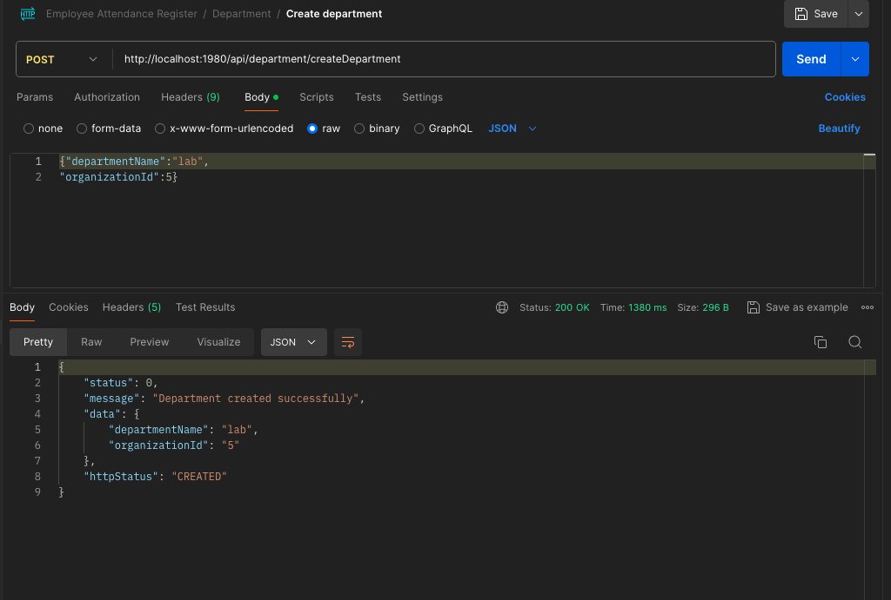

## Employee attendance register
### Description
This is a simple employee attendance register system that allows employees to clock in and out of work.
### Endpoints 
* POST http://localhost:1980/api/employee/createEmployee
* POST http://localhost:1980/api/employee/login
* POST http://localhost:1980/api/organization/createOrganization
* POST http://localhost:1980/api/department/createDepartment
* POST http://localhost:1980/api/attendance/registerAttendance
* GET http://localhost:1980/api/attendance/getAttendanceForEmployeeByDateRange
* GET http://localhost:1980/api/employee/getEmployeesByDepartment
* GET http://localhost:1980/api/employee/getOrganizationsEmployee/{{organizationId}}/employees
* GET http://localhost:1980/api/employee/getAllEmployees
* GET http://localhost:1980/api/employee/getEmployeeById/{{id}}


### Tools
* Java 17
* Spring Boot
* JUnit/Mockito
* PostgreSQL
* Docker
* Postman

## Testing API Endpoints
*POST  Create Employee  
```shell 
http://localhost:1980/api/employee/createEmployee
```
### sample request and response
```json
{
 "firstName": "Almon",
"lastName": "Dale",
"email": "almonDale@example.com",
"employeeType": "MEDICAL",
"phoneNumber": "+1650432198",
"password":"Password123#",
"departmentId": 1,
"gender": "MALE"
}
```
```json

   {
    "status": 200,
    "message": "Employee created successfully",
    "data": {
        "firstName": "Almon",
        "lastName": "Dale",
        "email": "almonDale@example.com",
        "phoneNumber": "+1650432198",
        "employeeType": "MEDICAL",
        "departmentName": "lab",
        "gender": "MALE"
    },
    "httpStatus": "OK"
}


```

### Sample images for  requests and responses


*POST  Create Organization


*POST  Create Department


*POST  Register Attendance


*GET  Get Attendance For Employee By Date Range


*GET  Get Employees By Department


*GET  Get Organizations Employee


*GET  Get All Employees


*GET  Get Employee By Id


### Building the application
```shell
mvn clean package
```
### Running the application
```shell    
mvn spring-boot:run
```
### Running the tests
```shell
mvn test
```

## To access Api documentation 
```shell


